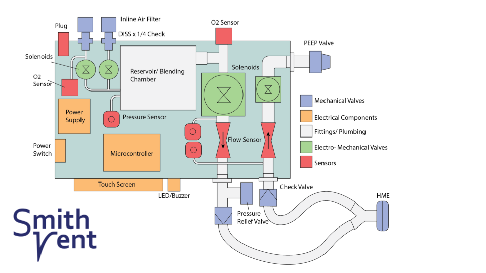
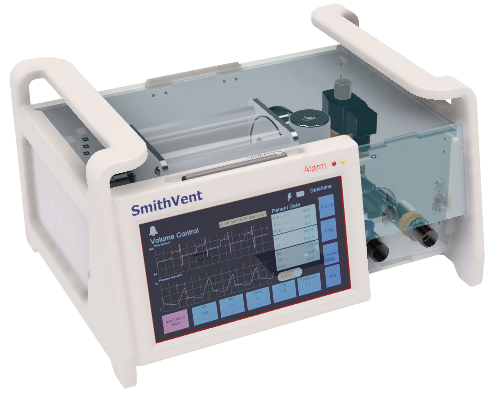

# SmithVent: Pneumatic, Cost-effective Ventilator Design
Designed by a group of Smith College alumni, faculty and friends for the [CoVent-19 Challenge](https://www.coventchallenge.com/)

## Master System Diagram


## Working Prototype


## CAD Model


### Defining values
```
Ti  = inspiration time
Te  = expiration time
p   = time period for a full breath cycle
bpm = breaths per minute
IE  = ratio of inspiration to expiration
VT  = tidal volume
V̇   = flow rate 
```

#### IE/BPM and timings
```
p = 1/BPM = Ti + Te (min)
IE = Ti/Te
```

#### Desired Inspiratory Flow (in L/min)


### Disclaimer 
**This code is provided for reference use only.** Our goal is to showcase the functionality of the Volume Control mode, which has been initially tested, and its auxiliary specification in terms of valve behavior and UI interaction. Pressure Support, which is meant to assist patients as they breathe on their own, is largely written but has not been tested. A version of the code for Pressure Support can be found in the **[https://github.com/SmithVent2020/circuit-control/tree/VC-Mod_Final](VC-Mod_Final)** branch.

**Caution**: The enclosed control software is specific to the SmithVent system and is not to be used as is. This is essential to ensure patient safety. Futher testing and software validation is needed in order to correct any faulty behavior and reach a fully functional state. 

This software is licensed under the MIT license.

### Nextion Library Details
The original [Nextion Library](https://github.com/itead/ITEADLIB_Arduino_Nextion) was used, with some changes to the following files:
- [NexConfig.h](https://github.com/SmithVent2020/circuit-control/blob/master/Nextion/NexConfig.h)
- [NexHardware.h](https://github.com/SmithVent2020/circuit-control/blob/master/Nextion/NexHardware.h)
- [NexHardware.cpp](https://github.com/SmithVent2020/circuit-control/blob/master/Nextion/NexHardware.cpp)

These changes were made mostly to allow the library to work with our circuit configuration. For example, we use Serial1 as opposed to the library's default Serial2.

Much appreciated credit to [RayLivingston](https://forum.arduino.cc/index.php?topic=620821.0)!

### PID Library Details

```
***************************************************************
* Arduino PID Library - Version 1.2.1
* by Brett Beauregard <br3ttb@gmail.com> brettbeauregard.com
*
* This Library is licensed under the MIT License
***************************************************************
 ```
 - For an ultra-detailed explanation of why the code is the way it is, please visit: 
   http://brettbeauregard.com/blog/2011/04/improving-the-beginners-pid-introduction/

 - For function documentation, see:  http://playground.arduino.cc/Code/PIDLibrary

